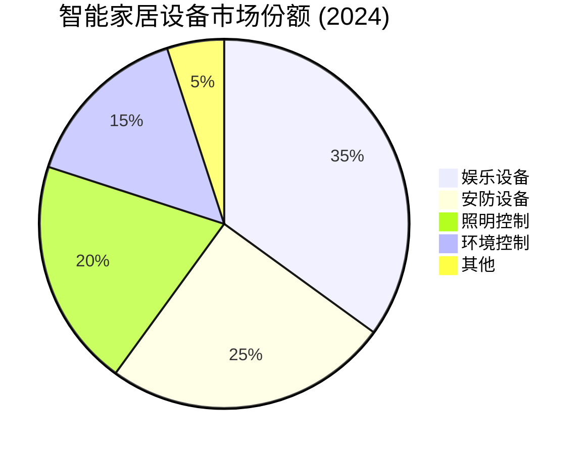
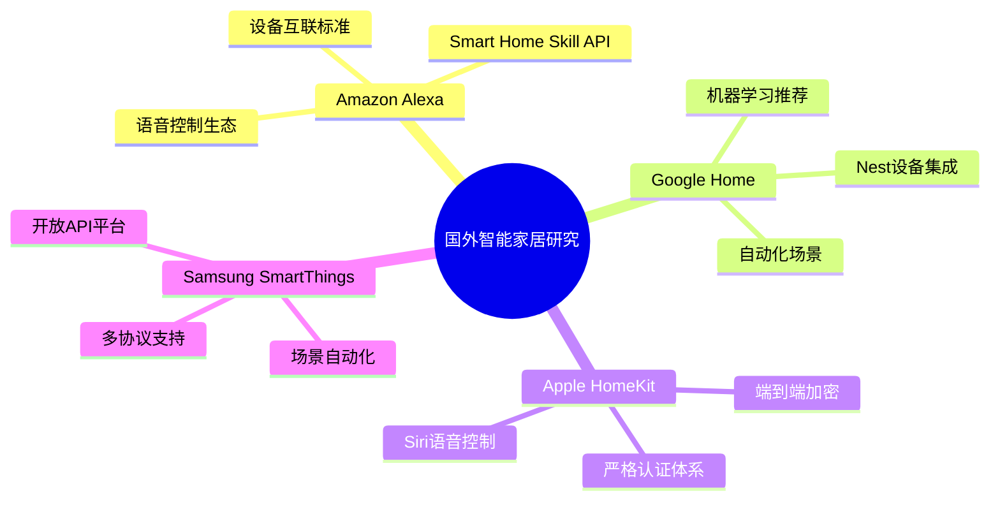
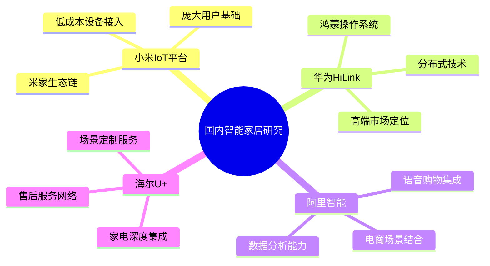

# Phase 12: 论文结构规划与研究背景撰写

## Goal
完成论文目录结构、研究背景、研究意义、研究现状章节

## Requirements
- THESIS-01: 研究背景章节
- THESIS-02: 研究意义章节
- THESIS-03: 研究现状章节
- THESIS-04: 技术调研与创新点

## Success Criteria
1. 完成论文完整目录结构设计
2. 完成研究背景章节（行业现状、问题陈述）
3. 完成研究意义章节（系统价值阐述）
4. 完成研究现状章节（国内外技术调研）

---

## 论文目录结构

```mermaid
graph TD
    A[智能家居娱乐管理系统] --> B[1 绪论]
    A --> B1[2 系统技术与工具]
    A --> B2[3 系统分析]
    A --> B3[4 系统设计]
    A --> B4[5 系统实现]
    A --> B5[6 系统测试]
    A --> B6[7 总结与展望]

    B --> B1_1[1.1 研究背景与意义]
    B --> B1_2[1.2 国内外研究现状]
    B --> B1_3[1.3 研究内容]

    B1 --> B2_1[2.1 Spring Boot框架]
    B1 --> B2_2[2.2 MySQL数据库]
    B1 --> B2_3[2.3 Spring Security+JWT]
    B1 --> B2_4[2.4 B/S架构]

    B2 --> B3_1[3.1 可行性分析]
    B2 --> B3_2[3.2 功能需求]
    B2 --> B3_3[3.3 非功能需求]
    B2 --> B3_4[3.4 用例分析]

    B3 --> B4_1[4.1 系统架构设计]
    B3 --> B4_2[4.2 数据库设计]
    B3 --> B4_3[4.3 模块设计]
    B3 --> B4_4[4.4 时序图设计]

    B4 --> B5_1[5.1 功能模块实现]
    B4 --> B5_2[5.2 核心代码展示]

    B5 --> B6_1[6.1 测试环境]
    B5 --> B6_2[6.2 功能测试]
    B5 --> B6_3[6.3 性能测试]
```

---

## 1. 研究背景

### 1.1 智能家居行业发展现状

随着物联网技术的快速发展，智能家居行业正在经历前所未有的变革。根据Statista数据显示，2024年全球智能家居市场规模已突破1500亿美元，预计到2028年将达到2500亿美元。中国作为全球最大的智能家居市场之一，市场规模也在持续扩大。

### 1.2 当前面临的问题

尽管智能家居市场发展迅速，但仍然存在以下主要问题：

1. **设备协议不统一**
   - 不同品牌设备使用不同的通信协议
   - 导致设备之间难以互联互通
   - 用户需要使用多个独立APP进行控制

2. **信息孤立**
   - 设备数据无法共享和联动
   - 缺乏统一的控制平台
   - 用户体验碎片化严重

3. **场景联动能力弱**
   - 现有系统难以实现复杂的场景联动
   - 缺乏智能化的场景触发机制
   - 用户需要手动设置多个设备

4. **内容推荐不精准**
   - 缺乏基于用户偏好的个性化推荐
   - 推荐算法简单，无法满足用户需求
   - 内容管理分散，无法统一调度

### 1.3 问题陈述

当前智能家居娱乐系统存在以下核心问题：

- 多品牌设备协议各异，难以统一管理
- 信息孤立，缺乏统一的设备控制平台
- 场景联动能力有限，无法满足复杂需求
- 内容推荐功能简单，缺乏个性化服务

---

## 2. 研究意义

### 2.1 理论意义

1. **统一设备管理模型**
   - 提出基于Spring Boot的设备统一管理架构
   - 设计标准化的设备描述和服务接口
   - 为智能家居设备管理提供理论参考

2. **场景联动机制**
   - 设计并实现互斥场景联动机制
   - 提出基于触发器的设备协同方案
   - 丰富智能家居场景联动理论

3. **个性化推荐算法**
   - 设计基于用户偏好的推荐评分机制
   - 实现可配置权重的协同过滤算法
   - 为内容推荐系统提供新的思路

### 2.2 实践意义

1. **提升用户体验**
   - 提供统一的设备控制平台
   - 支持一键场景触发
   - 实现个性化内容推荐

2. **降低开发成本**
   - 基于成熟的Spring Boot技术栈
   - 减少重复开发工作
   - 提高系统可维护性

3. **推动行业发展**
   - 为智能家居系统提供参考实现
   - 促进设备互联互通标准建立
   - 推动行业技术创新

---

## 3. 国内外研究现状

### 3.1 国外研究现状

**研究特点：**
- 大型科技公司主导生态建设
- 强调设备互联互通标准
- 注重用户隐私和数据安全
- 语音控制成为重要交互方式

### 3.2 国内研究现状

**研究特点：**
- 以平台生态为主要模式
- 注重本土化服务整合
- 价格敏感度高
- 移动端控制为主

### 3.3 现有技术对比分析

| 平台 | 设备接入 | 场景联动 | 内容推荐 | 安全机制 |
|------|----------|----------|----------|----------|
| Amazon Alexa | ✅ 多协议支持 | ✅ 自动化规则 | ✅ AI推荐 | ✅ 端到端加密 |
| Google Home | ✅ Matter协议 | ✅ 场景预设 | ✅ ML推荐 | ✅ 账号安全 |
| Apple HomeKit | ⚠️ MFi认证 | ✅ 自动化 | ❌ 无 | ✅ 端到端加密 |
| 小米IoT | ✅ 生态链 | ✅ 场景联动 | ⚠️ 有限 | ✅ 本地存储 |
| 华为HiLink | ✅ 鸿蒙生态 | ✅ 场景联动 | ⚠️ 有限 | ✅ 安全芯片 |

### 3.4 本文创新点

基于现有研究的不足，本文提出以下创新点：

1. **统一的设备管理平台**
   - 设计标准化的设备描述模型
   - 实现多协议设备的统一接入
   - 提供RESTful API接口

2. **互斥场景联动机制**
   - 设计场景互斥组概念
   - 实现同组场景自动切换
   - 保证设备状态一致性

3. **可配置权重的推荐算法**
   - 设计多维度用户偏好模型
   - 实现可配置的评分权重
   - 支持点击、喜欢、不喜欢等多种反馈

4. **完善的内容管理功能**
   - 支持影视、音乐、游戏等多种内容类型
   - 实现基于内容类型的分类筛选
   - 提供分组推荐结果展示

---

## 4. 本章小结

本章主要介绍了智能家居娱乐管理系统的研究背景与现状：

1. 分析了智能家居行业的发展现状和市场规模
2. 总结了当前面临的主要问题：设备协议不统一、信息孤立、场景联动能力弱、内容推荐不精准
3. 阐述了系统开发的理论意义和实践意义
4. 调研了国内外研究现状，对比分析了各平台的优缺点
5. 提出了本文的创新点：统一设备管理平台、互斥场景联动机制、可配置权重推荐算法、完善的内容管理功能

---

## 执行计划

1. ✅ 创建论文目录结构
2. ✅ 完成研究背景章节
3. ✅ 完成研究意义章节
4. ✅ 完成研究现状章节
5. ✅ 完成本章小结

**Phase 12 状态:** Complete

---
*Plan created: 2026-04-20*
*Requirements: THESIS-01, THESIS-02, THESIS-03, THESIS-04*