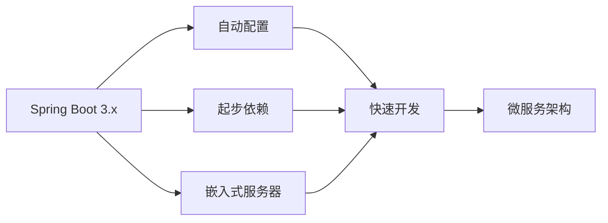
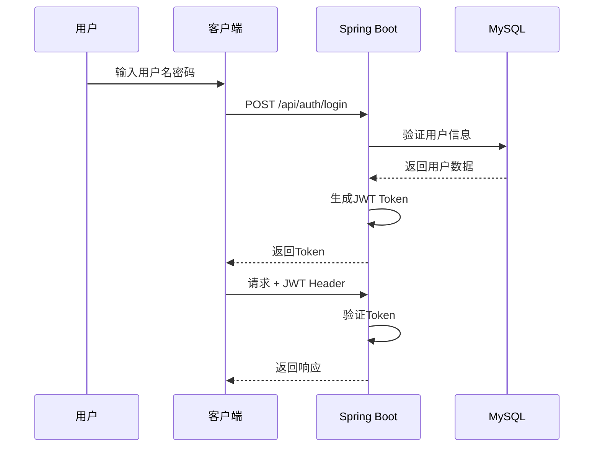
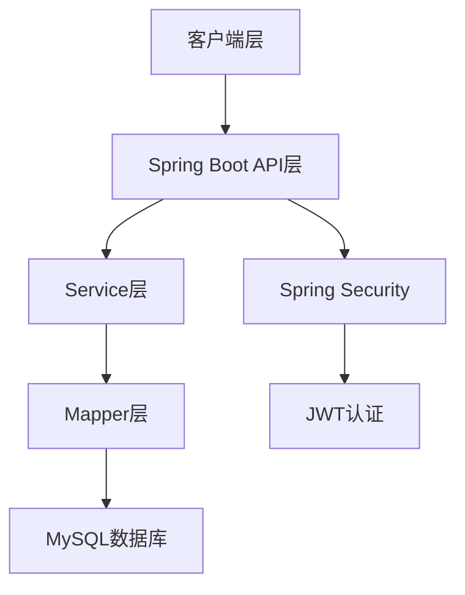
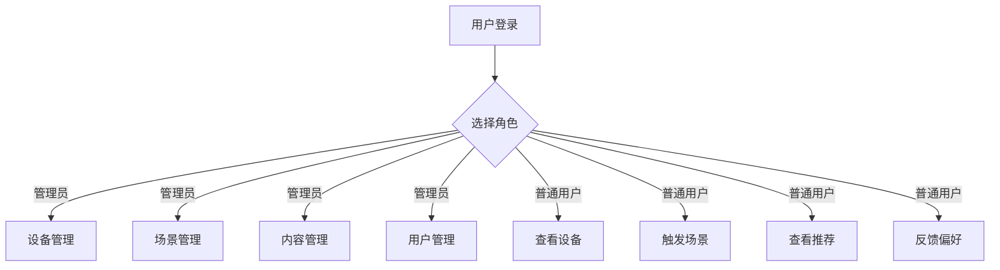
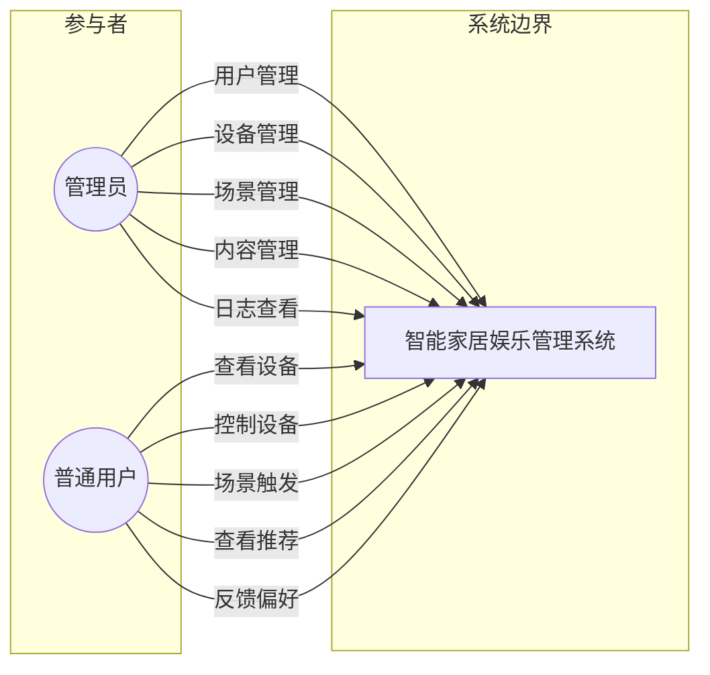
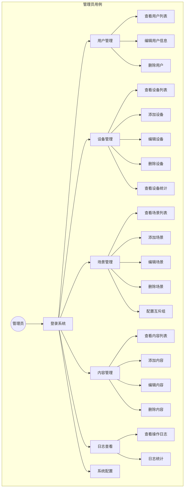
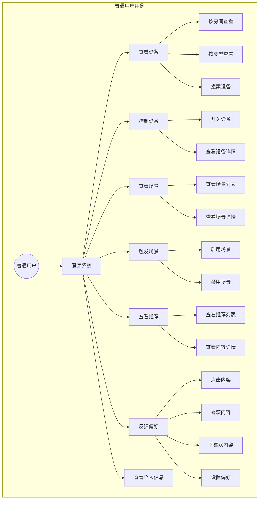

# Phase 13: 可行性分析与需求分析

## Goal
完成可行性分析、需求分析章节（用例图、功能分析、性能分析）

## Requirements
- THESIS-05: 技术可行性分析
- THESIS-06: 经济可行性分析
- THESIS-07: 操作可行性分析
- THESIS-08: 用例图设计
- THESIS-09: 功能分析
- THESIS-10: 性能分析

## Success Criteria
1. 完成技术可行性分析（Spring Boot + MySQL + JWT技术栈）
2. 完成经济可行性分析
3. 完成操作可行性分析
4. 完成用例图设计（管理员/普通用户）
5. 完成功能分析（设备管理、场景管理、内容推荐、用户管理）
6. 完成性能分析（响应时间、并发支持）

---

## 1. 可行性分析

### 1.1 技术可行性分析

#### 1.1.1 Spring Boot框架

**技术优势：**
- 内置嵌入式Tomcat/Jetty服务器，部署简单
- 自动配置减少XML配置工作量
- 丰富的starter组件，生态完善
- 强大的社区支持和文档

**适用性分析：**
- ✅ 适合构建RESTful API服务
- ✅ 支持Spring Security安全框架
- ✅ 与MyBatis-Plus完美集成
- ✅ 提供健康检查和监控功能

#### 1.1.2 MySQL数据库

**技术优势：**
- 开源免费，社区活跃
- 支持ACID事务特性
- 丰富的数据类型支持
- 高并发处理能力（支持50万+ QPS）

**适用性分析：**
- ✅ 支持复杂查询和关联操作
- ✅ 支持JSON类型存储配置信息
- ✅ 支持分页查询优化
- ✅ 成熟的备份恢复机制

#### 1.1.3 Spring Security + JWT

**技术优势：**
- JWT实现无状态认证，性能高
- 支持多种认证方式（用户名密码、Token）
- 细粒度的权限控制（@PreAuthorize）
- 与Spring Boot完美集成

**适用性分析：**
- ✅ 无状态设计适合分布式部署
- ✅ Token可跨域共享
- ✅ 权限控制灵活可扩展
- ✅ 密码BCrypt加密，安全性高

#### 1.1.4 整体技术架构

**技术可行性结论：**
- 所有核心技术均为成熟稳定的技术
- 社区文档丰富，开发成本低
- 技术栈之间兼容性良好
- ✅ 技术可行性：满足

### 1.2 经济可行性分析

#### 1.2.1 开发成本

| 项目 | 成本 | 说明 |
|------|------|------|
| 开发工具 | 低 | 使用IntelliJ IDEA社区版/Eclipse免费 |
| 服务器 | 低 | 可使用云服务器或本地机器 |
| 数据库 | 低 | MySQL社区版免费 |
| 第三方服务 | 无 | 无需付费API |

**开发成本估算：**
- 软件许可费用：0元
- 服务器费用：500元/年（云服务器）
- 运维成本：低（自动化部署）

#### 1.2.2 运营成本

| 项目 | 成本 | 说明 |
|------|------|------|
| 云服务器 | 500元/年 | 2核4G配置 |
| 域名费用 | 100元/年 | 可选 |
| 带宽费用 | 低 | 按量付费 |

**运营成本估算：**
- 首年运营成本：约600元
- 年度运营成本：约600元

#### 1.2.3 效益分析

1. **直接效益**
   - 减少多APP管理成本
   - 提高设备管理效率
   - 增强用户体验

2. **间接效益**
   - 为未来商业化奠定基础
   - 积累智能家居系统开发经验
   - 提升技术团队能力

**经济可行性结论：**
- 开发成本低，经济投入小
- 系统简单，运营成本低
- ✅ 经济可行性：满足

### 1.3 操作可行性分析

#### 1.3.1 用户操作分析

**操作复杂度评估：**
- 界面设计简洁直观
- 操作流程符合用户习惯
- 提供操作引导和提示

#### 1.3.2 维护可行性

1. **代码维护**
   - 分层架构清晰，模块解耦
   - 统一代码风格和规范
   - 完整的API文档

2. **数据维护**
   - 数据库结构规范化
   - 支持数据备份恢复
   - 操作日志完整可追溯

**操作可行性结论：**
- ✅ 操作简单易上手
- ✅ 维护成本低
- ✅ 操作可行性：满足

---

## 2. 需求分析

### 2.1 系统用例图

### 2.2 管理员用例详图

### 2.3 普通用户用例详图

---

## 3. 功能分析

### 3.1 功能模块结构

```mermaid
graph TD
    A[智能家居娱乐管理系统] --> B[用户模块]
    A --> C[设备模块]
    A --> D[场景模块]
    A --> E[内容模块]
    A --> F[推荐模块]
    A --> G[日志模块]

    B --> B1[注册]
    B --> B2[登录]
    B --> B3[用户信息管理]
    B --> B4[权限管理]

    C --> C1[设备列表]
    C --> C2[设备详情]
    C --> C3[设备增删改]
    C --> C4[设备状态管理]
    C --> C5[设备统计]

    D --> D1[场景列表]
    D --> D2[场景详情]
    D --> D3[场景增删改]
    D --> D4[场景触发]
    D --> D5[互斥组管理]
    D --> D6[设备关联]

    E --> E1[内容列表]
    E --> E2[内容详情]
    E --> E3[内容增删改]
    E --> E4[类型筛选]

    F --> F1[推荐列表]
    F --> F2[点击反馈]
    F --> F3[喜欢/不喜欢]
    F --> F4[偏好设置]
    F --> F5[权重配置]

    G --> G1[日志列表]
    G --> G2[日志统计]
    G --> G3[日志筛选]
```

### 3.2 核心功能描述

#### 3.2.1 用户管理功能

| 功能 | 描述 | 优先级 |
|------|------|--------|
| 用户注册 | 用户可通过用户名密码注册账号 | P0 |
| 用户登录 | 用户可通过用户名密码登录获取JWT | P0 |
| 用户信息查看 | 用户可查看自己的个人信息 | P0 |
| 用户信息修改 | 用户可修改昵称、头像等信息 | P0 |
| 用户列表 | 管理员可查看所有用户列表 | P0 |
| 用户删除 | 管理员可删除用户 | P0 |

#### 3.2.2 设备管理功能

| 功能 | 描述 | 优先级 |
|------|------|--------|
| 设备列表 | 查看所有设备，支持分页、筛选 | P0 |
| 设备详情 | 查看设备详细信息 | P0 |
| 设备新增 | 添加新设备 | P0 |
| 设备编辑 | 修改设备信息 | P0 |
| 设备删除 | 删除设备 | P0 |
| 设备状态 | 更新设备在线/离线状态 | P0 |
| 设备统计 | 按类型、房间统计设备数量 | P1 |

#### 3.2.3 场景管理功能

| 功能 | 描述 | 优先级 |
|------|------|--------|
| 场景列表 | 查看所有场景 | P0 |
| 场景详情 | 查看场景及关联设备 | P0 |
| 场景新增 | 创建新场景 | P0 |
| 场景编辑 | 修改场景配置 | P0 |
| 场景删除 | 删除场景 | P0 |
| 场景启用/禁用 | 启用或禁用场景 | P0 |
| 场景触发 | 触发场景，联动设备 | P0 |
| 互斥组管理 | 设置场景互斥组 | P0 |
| 设备关联 | 关联/取消关联设备 | P0 |

#### 3.2.4 内容管理功能

| 功能 | 描述 | 优先级 |
|------|------|--------|
| 内容列表 | 查看内容，支持分页、筛选 | P0 |
| 内容详情 | 查看内容详细信息 | P0 |
| 内容新增 | 添加新内容 | P0 |
| 内容编辑 | 修改内容信息 | P0 |
| 内容删除 | 删除内容 | P0 |
| 类型筛选 | 按电影/音乐/游戏筛选 | P0 |

#### 3.2.5 推荐管理功能

| 功能 | 描述 | 优先级 |
|------|------|--------|
| 推荐列表 | 查看个性化推荐内容 | P0 |
| 点击记录 | 记录用户点击推荐内容 | P0 |
| 喜欢/不喜欢 | 用户反馈喜欢或不喜欢 | P0 |
| 偏好设置 | 用户设置内容类型偏好 | P0 |
| 权重配置 | 管理员配置推荐权重 | P1 |

#### 3.2.6 日志管理功能

| 功能 | 描述 | 优先级 |
|------|------|--------|
| 日志列表 | 查看操作日志 | P0 |
| 日志统计 | 统计操作类型分布 | P1 |
| 日志筛选 | 按时间、用户、操作类型筛选 | P1 |

---

## 4. 性能分析

### 4.1 性能需求指标

```mermaid
gantt
    title 性能需求指标
    dateFormat X
    axisFormat %s

    section 响应时间
    简单查询 < 100ms :0, 100
    复杂查询 < 200ms :0, 200
    设备控制 < 500ms :0, 500

    section 并发能力
    支持100+并发 :0, 100
    API响应 < 200ms :0, 200

    section 数据量
    支持万级数据 :0, 10000
```

### 4.2 性能指标表

| 指标项 | 要求 | 说明 |
|--------|------|------|
| 接口响应时间 | < 200ms | 99%请求在200ms内完成 |
| 并发支持 | 100+ | 支持100个并发用户 |
| 数据存储 | 万级 | 支持万级数据记录 |
| 系统可用性 | > 99% | 系统稳定运行 |
| 错误率 | < 1% | 请求错误率低于1% |

### 4.3 性能优化策略

1. **数据库优化**
   - 使用索引优化查询
   - 分页查询减少数据量
   - 避免全表扫描

2. **缓存策略**
   - 热点数据缓存
   - Session管理优化

3. **连接池**
   - 配置合理连接池大小
   - 连接复用减少开销

---

## 本章小结

本章完成了智能家居娱乐管理系统的可行性与需求分析：

1. **可行性分析**
   - 技术可行性：Spring Boot + MySQL + JWT技术栈成熟稳定
   - 经济可行性：开发成本低，运营成本可控
   - 操作可行性：操作简单，维护成本低

2. **需求分析**
   - 完成用例图设计（管理员、普通用户角色）
   - 完成功能分析（6大功能模块）
   - 完成性能分析（响应时间、并发支持指标）

---

## 执行计划

1. ✅ 完成技术可行性分析
2. ✅ 完成经济可行性分析
3. ✅ 完成操作可行性分析
4. ✅ 完成用例图设计
5. ✅ 完成功能分析
6. ✅ 完成性能分析

**Phase 13 状态:** Complete

---
*Plan created: 2026-04-20*
*Requirements: THESIS-05, THESIS-06, THESIS-07, THESIS-08, THESIS-09, THESIS-10*