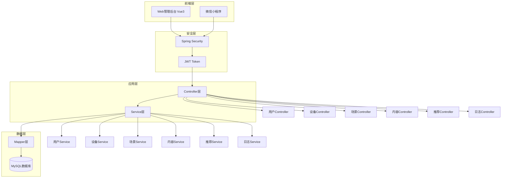
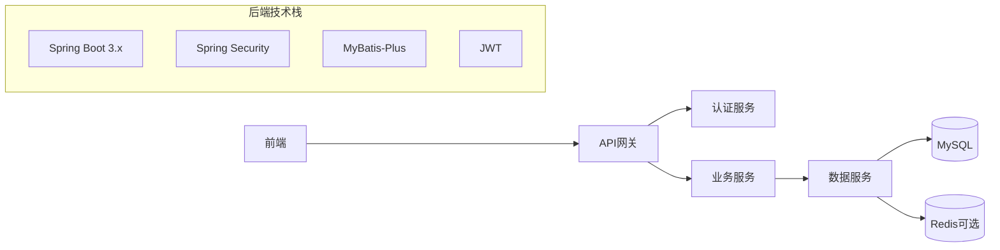
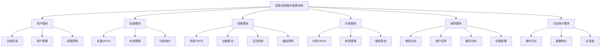
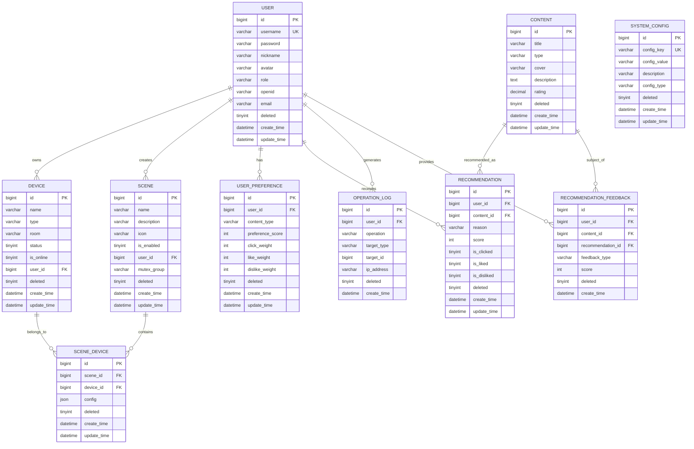
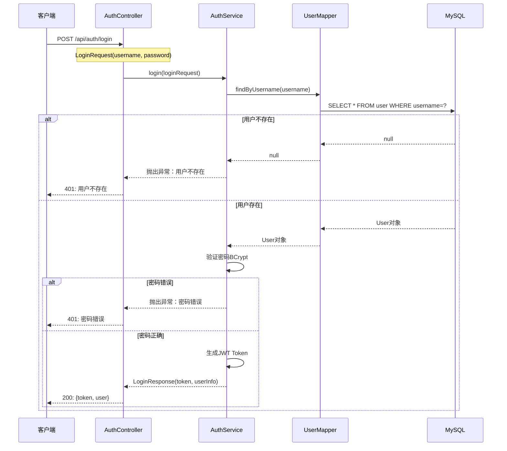
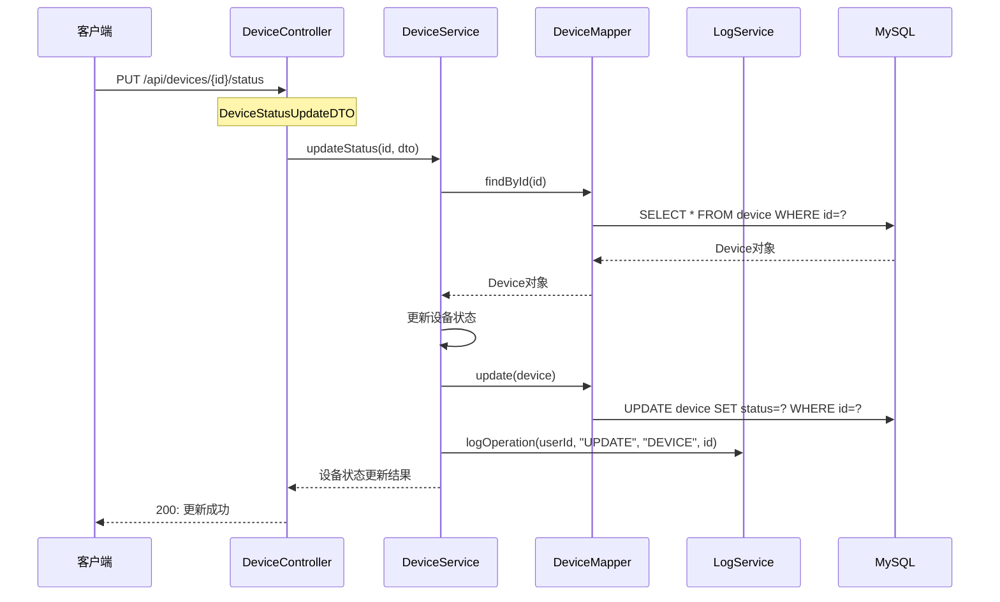
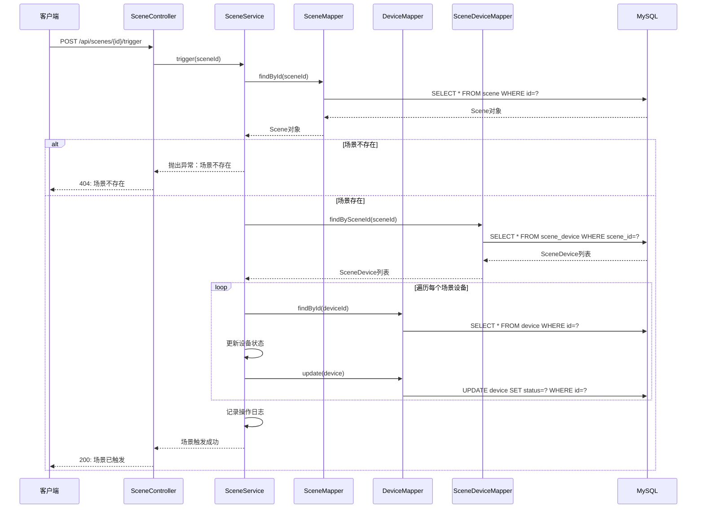
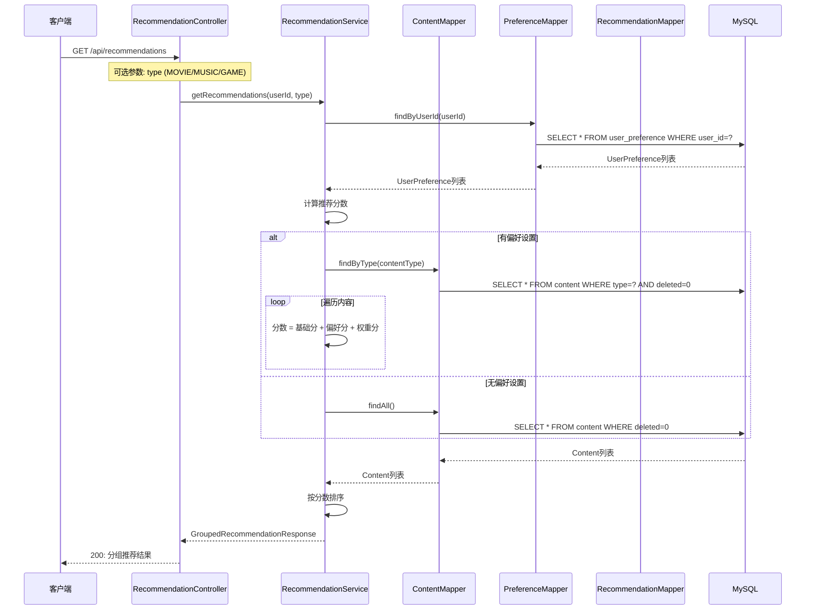
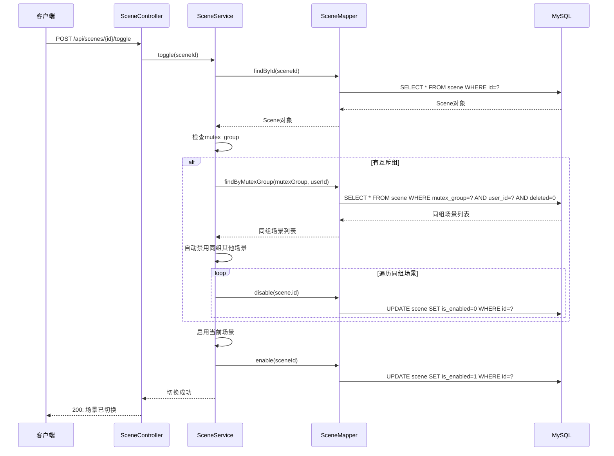

# Phase 14: 概要设计

## Goal
完成概要设计章节（数据库ER图、功能模块图、时序图）

## Requirements
- THESIS-11: 数据库ER图设计
- THESIS-12: 功能模块图设计
- THESIS-13: 时序图设计

## Success Criteria
1. 完成数据库ER图设计（user, device, scene, scene_device, content, user_preference, recommendation, operation_log等实体关系）
2. 完成功能模块图设计（系统架构图）
3. 完成核心时序图（用户登录、设备控制、场景触发、推荐生成）

---

## 1. 系统架构设计

### 1.1 整体架构



### 1.2 技术架构



### 1.3 系统功能模块图



---

## 2. 数据库设计

### 2.1 数据库ER图

```mermaid
erDiagram
    USER ||--o{ DEVICE : owns
    USER ||--o{ SCENE : creates
    USER ||--o{ USER_PREFERENCE : has
    USER ||--o{ RECOMMENDATION : receives
    USER ||--o{ OPERATION_LOG : generates

    SCENE ||--o{ SCENE_DEVICE : contains
    DEVICE ||--o{ SCENE_DEVICE : belongs_to

    CONTENT ||--o{ RECOMMENDATION : recommended_as
    CONTENT ||--o{ USER_PREFERENCE : preferred_type

    USER_PREFERENCE {
        bigint id PK
        bigint user_id FK
        varchar content_type
        int preference_score
        int click_weight
        int like_weight
        int dislike_weight
    }

    RECOMMENDATION ||--o{ RECOMMENDATION_FEEDBACK : has
    RECOMMENDATION_FEEDBACK }o--|| USER
    RECOMMENDATION_FEEDBACK }o--|| CONTENT
```

### 2.2 完整实体关系图



### 2.3 数据库表结构

#### 2.3.1 用户表 (user)

| 字段名 | 类型 | 说明 |
|--------|------|------|
| id | BIGINT | 主键，自增 |
| username | VARCHAR(50) | 用户名，唯一 |
| password | VARCHAR(255) | 密码（BCrypt加密） |
| nickname | VARCHAR(100) | 昵称 |
| avatar | VARCHAR(255) | 头像URL |
| role | VARCHAR(20) | 角色：ADMIN/USER |
| openid | VARCHAR(100) | 微信OpenID |
| email | VARCHAR(255) | 邮箱 |
| deleted | TINYINT | 删除标记（0=未删，1=已删） |
| create_time | DATETIME | 创建时间 |
| update_time | DATETIME | 更新时间 |

#### 2.3.2 设备表 (device)

| 字段名 | 类型 | 说明 |
|--------|------|------|
| id | BIGINT | 主键，自增 |
| name | VARCHAR(100) | 设备名称 |
| type | VARCHAR(50) | 设备类型（TV/SPEAKER/LIGHT等） |
| room | VARCHAR(50) | 房间位置 |
| status | TINYINT | 状态（0=禁用，1=启用） |
| is_online | TINYINT | 在线状态（0=离线，1=在线） |
| user_id | BIGINT | 所属用户ID |
| deleted | TINYINT | 删除标记 |
| create_time | DATETIME | 创建时间 |
| update_time | DATETIME | 更新时间 |

#### 2.3.3 场景表 (scene)

| 字段名 | 类型 | 说明 |
|--------|------|------|
| id | BIGINT | 主键，自增 |
| name | VARCHAR(100) | 场景名称 |
| description | VARCHAR(255) | 场景描述 |
| icon | VARCHAR(50) | 场景图标 |
| is_enabled | TINYINT | 启用状态 |
| user_id | BIGINT | 所属用户ID |
| mutex_group | VARCHAR(50) | 互斥组名称 |
| deleted | TINYINT | 删除标记 |
| create_time | DATETIME | 创建时间 |
| update_time | DATETIME | 更新时间 |

#### 2.3.4 场景设备关联表 (scene_device)

| 字段名 | 类型 | 说明 |
|--------|------|------|
| id | BIGINT | 主键，自增 |
| scene_id | BIGINT | 场景ID |
| device_id | BIGINT | 设备ID |
| config | JSON | 设备配置（功率、亮度等） |
| deleted | TINYINT | 删除标记 |
| create_time | DATETIME | 创建时间 |
| update_time | DATETIME | 更新时间 |

#### 2.3.5 内容表 (content)

| 字段名 | 类型 | 说明 |
|--------|------|------|
| id | BIGINT | 主键，自增 |
| title | VARCHAR(100) | 内容标题 |
| type | VARCHAR(20) | 内容类型（MOVIE/MUSIC/GAME） |
| cover | VARCHAR(255) | 封面URL |
| description | TEXT | 内容描述 |
| rating | DECIMAL(2,1) | 评分（0.0-5.0） |
| deleted | TINYINT | 删除标记 |
| create_time | DATETIME | 创建时间 |
| update_time | DATETIME | 更新时间 |

#### 2.3.6 用户偏好表 (user_preference)

| 字段名 | 类型 | 说明 |
|--------|------|------|
| id | BIGINT | 主键，自增 |
| user_id | BIGINT | 用户ID |
| content_type | VARCHAR(20) | 内容类型 |
| preference_score | INT | 偏好分数 |
| click_weight | INT | 点击权重（默认5） |
| like_weight | INT | 喜欢权重（默认10） |
| dislike_weight | INT | 不喜欢权重（默认-20） |
| deleted | TINYINT | 删除标记 |
| create_time | DATETIME | 创建时间 |
| update_time | DATETIME | 更新时间 |

---

## 3. 时序图设计

### 3.1 用户登录时序图



### 3.2 设备控制时序图



### 3.3 场景触发时序图



### 3.4 推荐生成时序图



### 3.5 场景互斥时序图



---

## 本章小结

本章完成了智能家居娱乐管理系统的概要设计：

1. **系统架构设计**
   - 采用前后端分离架构
   - Spring Boot + MySQL + Spring Security技术栈
   - 模块化分层设计（Controller/Service/Mapper）

2. **数据库设计**
   - 完成10张表的ER图设计
   - 包含用户、设备、场景、内容、推荐等核心实体
   - 建立完整的表关系（1:N, N:N）

3. **时序图设计**
   - 完成用户登录时序图
   - 完成设备控制时序图
   - 完成场景触发时序图
   - 完成推荐生成时序图
   - 完成场景互斥时序图

---

## 执行计划

1. ✅ 完成系统架构设计
2. ✅ 完成功能模块图
3. ✅ 完成数据库ER图
4. ✅ 完成时序图设计

**Phase 14 状态:** Complete

---
*Plan created: 2026-04-20*
*Requirements: THESIS-11, THESIS-12, THESIS-13*