# Phase 15: 详细设计

## Goal
完成详细设计章节（程序流程图）

## Requirements
- THESIS-14: 程序流程图

## Success Criteria
1. 完成设备管理程序流程图
2. 完成场景触发程序流程图
3. 完成推荐算法程序流程图

---

## 1. 设备管理程序流程图

### 1.1 设备新增流程

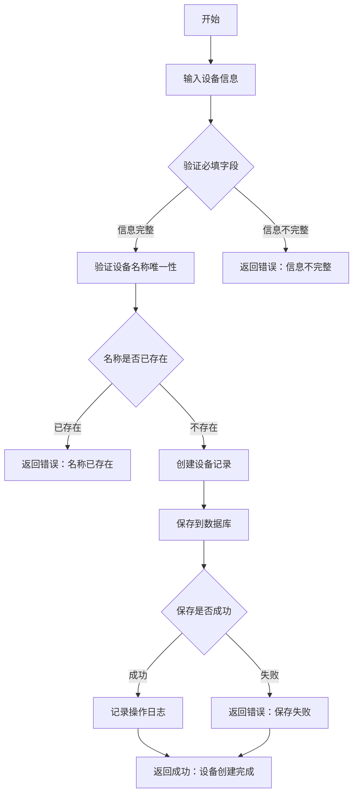

### 1.2 设备状态更新流程

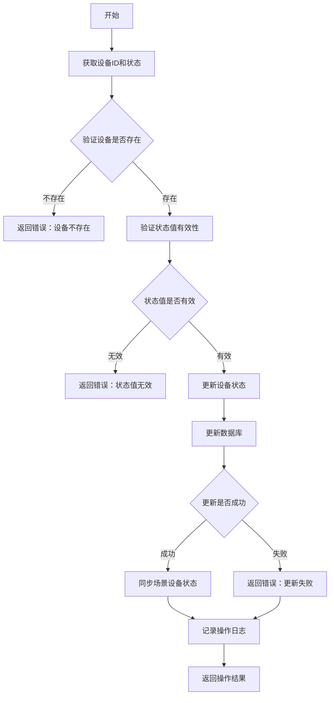

### 1.3 设备删除流程

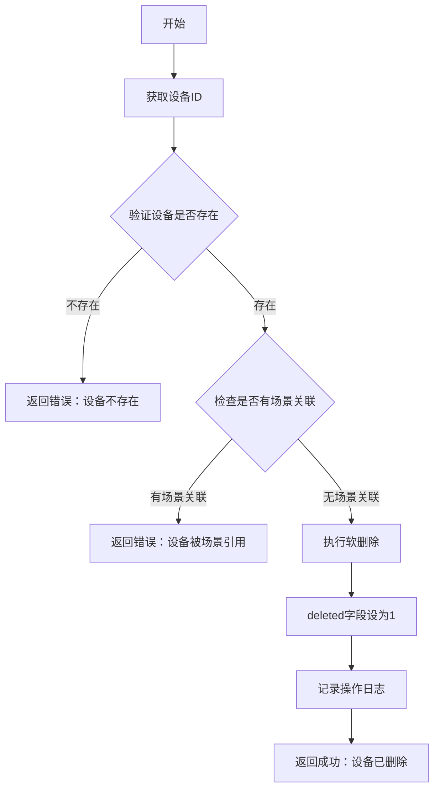

---

## 2. 场景触发程序流程图

### 2.1 场景触发主流程

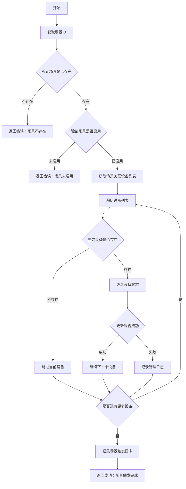

### 2.2 场景互斥处理流程

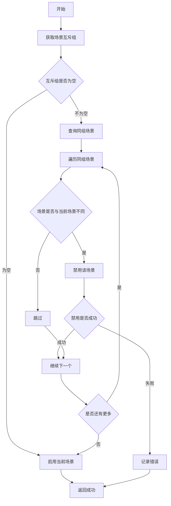

### 2.3 场景设备联动流程

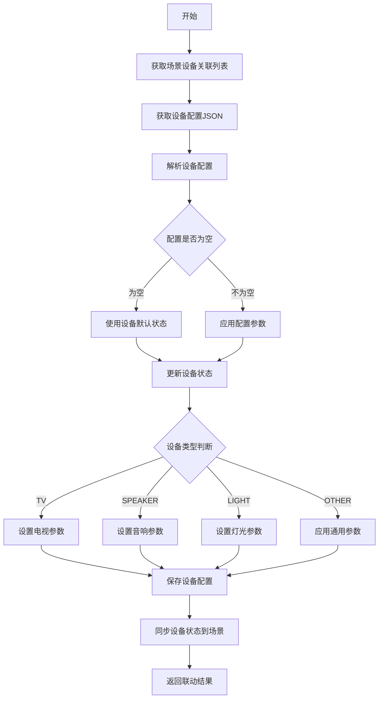

---

## 3. 推荐算法程序流程图

### 3.1 推荐生成主流程

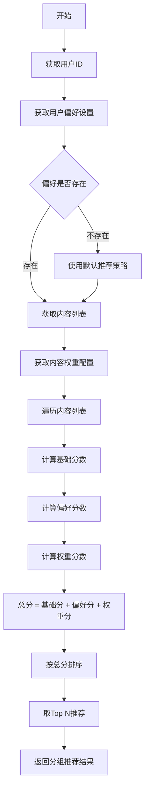

### 3.2 协同过滤推荐流程

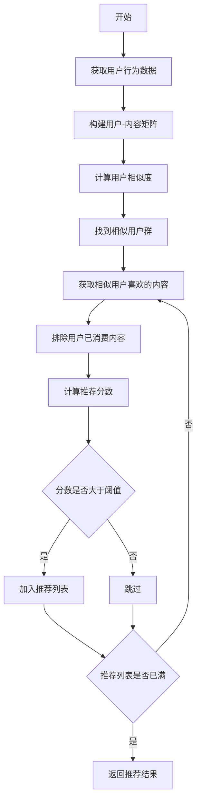

### 3.3 用户反馈处理流程

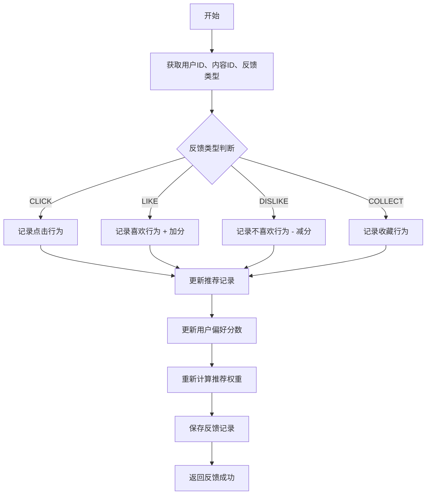

### 3.4 推荐分数计算流程

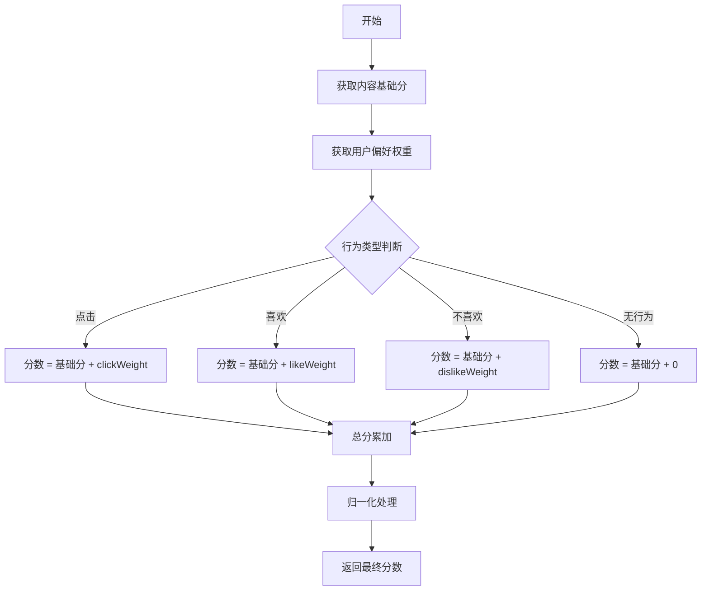

---

## 4. 用户认证程序流程图

### 4.1 用户注册流程

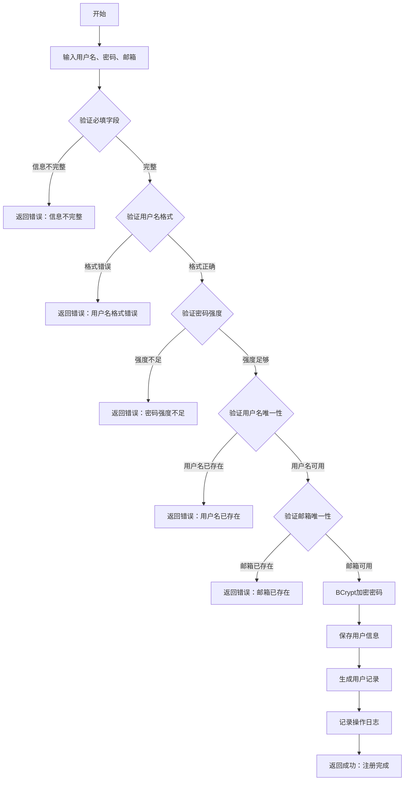

### 4.2 用户登录流程

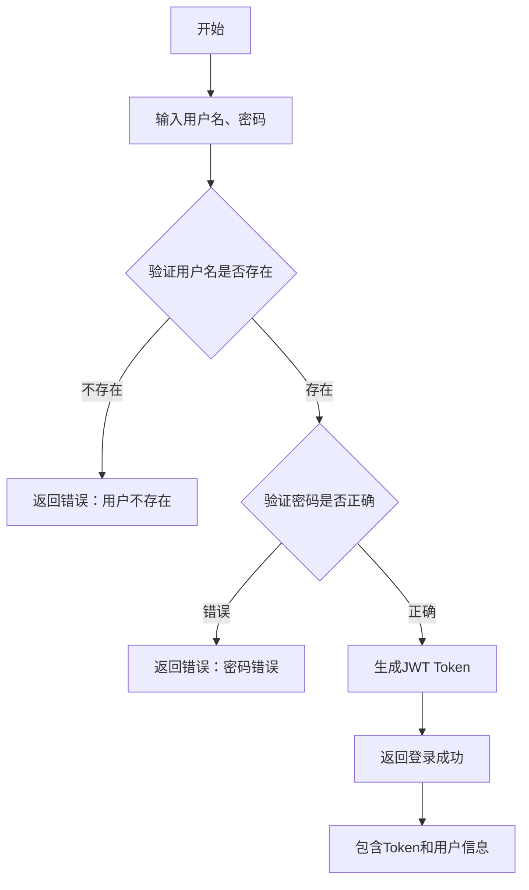

---

## 本章小结

本章完成了智能家居娱乐管理系统的详细设计：

1. **设备管理程序流程图**
   - 设备新增流程
   - 设备状态更新流程
   - 设备删除流程

2. **场景触发程序流程图**
   - 场景触发主流程
   - 场景互斥处理流程
   - 场景设备联动流程

3. **推荐算法程序流程图**
   - 推荐生成主流程
   - 协同过滤推荐流程
   - 用户反馈处理流程
   - 推荐分数计算流程

4. **用户认证程序流程图**
   - 用户注册流程
   - 用户登录流程

---

## 执行计划

1. ✅ 完成设备管理程序流程图
2. ✅ 完成场景触发程序流程图
3. ✅ 完成推荐算法程序流程图
4. ✅ 完成用户认证程序流程图

**Phase 15 状态:** Complete

---
*Plan created: 2026-04-20*
*Requirement: THESIS-14*