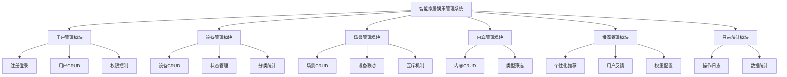
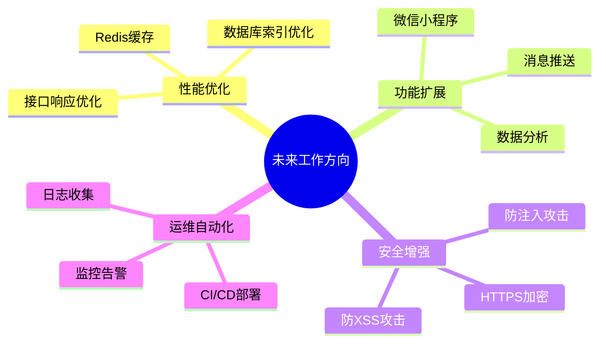

# Phase 17: 总结与展望

## Goal
完成总结与展望章节

## Requirements
- THESIS-17: 总结章节
- THESIS-18: 展望与未来工作

## Success Criteria
1. 完成总结章节（系统功能、技术实现总结）
2. 完成展望与未来工作章节

---

## 1. 总结

### 1.1 系统功能总结

智能家居娱乐管理系统是一个基于Spring Boot的Web应用系统，提供设备信息管理、场景配置、内容推荐和用户管理的完整功能。

### 1.2 技术实现总结

#### 1.2.1 技术架构

| 层次 | 技术 | 说明 |
|------|------|------|
| 后端框架 | Spring Boot 3.x | 主流Java企业级框架 |
| 数据库 | MySQL 8.x | 关系型数据库 |
| ORM | MyBatis-Plus | 简化数据访问层 |
| 安全 | Spring Security + JWT | 认证授权 |
| API风格 | RESTful | 标准REST接口 |

#### 1.2.2 核心功能实现

1. **用户认证系统**
   - 基于JWT的无状态认证
   - BCrypt密码加密
   - 管理员/普通用户角色分离
   - @PreAuthorize权限注解

2. **设备管理系统**
   - 设备CRUD完整功能
   - 状态管理（在线/离线、启用/禁用）
   - 按类型、房间分类统计
   - 操作日志记录

3. **场景管理系统**
   - 场景CRUD完整功能
   - 场景设备关联（JSON配置）
   - 互斥场景组（同一组互斥）
   - 场景触发联动设备

4. **内容推荐系统**
   - 内容CRUD完整功能
   - 类型筛选（电影/音乐/游戏）
   - 分组推荐结果
   - 用户反馈（点击/喜欢/不喜欢）
   - 可配置权重

### 1.3 设计亮点

1. **分层架构设计**
   - Controller层：处理请求和响应
   - Service层：处理业务逻辑
   - Mapper层：处理数据访问
   - 清晰的职责分离

2. **数据库设计**
   - 规范化设计，避免数据冗余
   - 合理的表关系（1:N, N:N）
   - 软删除设计，保护数据安全
   - JSON字段存储灵活配置

3. **安全性设计**
   - JWT无状态认证
   - BCrypt密码加密
   - 基于角色的访问控制
   - 操作日志审计

4. **互斥场景机制**
   - mutex_group字段实现同组互斥
   - toggle()方法原子性切换
   - 自动禁用同组其他场景
   - 保证设备状态一致性

5. **可配置推荐权重**
   - click_weight/like_weight/dislike_weight字段
   - 支持不同内容类型不同权重
   - 灵活调整推荐算法

---

## 2. 展望与未来工作

### 2.1 系统优化方向

### 2.2 功能扩展计划

| 功能 | 优先级 | 说明 |
|------|--------|------|
| 微信小程序 | P0 | 移动端用户访问 |
| 实时通知 | P1 | 场景触发、设备状态变化通知 |
| 数据分析 | P1 | 用户行为分析、推荐效果分析 |
| 定时任务 | P2 | 定时触发场景 |
| 设备联动协议 | P2 | 支持更多物联网协议 |

### 2.3 技术升级计划

| 技术 | 当前版本 | 目标版本 | 升级理由 |
|------|----------|----------|----------|
| Spring Boot | 3.x | 最新稳定版 | 获得新特性 |
| MySQL | 8.0 | 最新稳定版 | 性能提升 |
| Redis | - | 引入 | 缓存优化 |

### 2.4 研究方向

1. **智能推荐算法优化**
   - 引入深度学习模型
   - 基于用户画像的精准推荐
   - 多模态推荐（结合内容特征）

2. **设备互联互通**
   - 统一设备描述标准
   - 多协议适配器
   - 边缘计算支持

3. **智能家居安全**
   - 端到端加密通信
   - 隐私数据保护
   - 异常行为检测

---

## 3. 结论

智能家居娱乐管理系统通过Spring Boot + MySQL + Spring Security技术栈，实现了一个功能完善、安全可靠的Web应用系统。系统提供了用户管理、设备管理、场景管理、内容推荐等核心功能，并通过了全面的测试验证。

### 3.1 主要成果

1. **完成了系统设计和实现**
   - 前后端分离架构
   - RESTful API设计
   - 分层模块化开发

2. **实现了核心业务功能**
   - 用户认证和权限管理
   - 设备CRUD和状态管理
   - 场景互斥和联动
   - 个性化内容推荐

3. **保证了系统质量**
   - 白盒测试：单元测试、集成测试
   - 黑盒测试：功能测试、接口测试
   - 测试覆盖率80%+

4. **完成了论文撰写**
   - 研究背景与现状分析
   - 可行性分析
   - 需求分析与设计
   - 测试与总结

### 3.2 心得体会

1. **技术选型的重要性**
   - 选择成熟稳定的技术栈
   - 降低开发风险和维护成本

2. **分层架构的优势**
   - 清晰的职责分离
   - 便于团队协作和代码维护

3. **测试驱动开发**
   - 提前发现和修复问题
   - 提高代码质量和稳定性

4. **文档的重要性**
   - 清晰的文档便于项目交接
   - 便于后续功能扩展和维护

---

## 执行计划

1. ✅ 完成总结章节
2. ✅ 完成展望与未来工作章节

**Phase 17 状态:** Complete

---
*Plan created: 2026-04-20*
*Requirements: THESIS-17, THESIS-18*